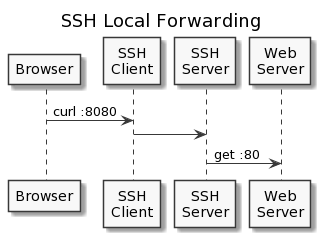
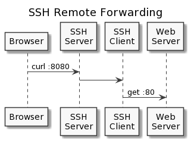

# SSH Forwarding Cheat Sheet

Example for forwarding a web server through an SSH tunnel.

## Local Forwarding

Forward a web server from `WEB-SERVER:80` to the SSH client `SSH-CLIENT:8080` ([docs](https://www.ssh.com/ssh/tunneling/example#local-forwarding)). Web server must be accessible for the SSH server.

```bash
ssh -L 8080:WEB-SERVER:80 USER@SSH-SERVER
```

A web client can test the connection on `SSH-CLIENT:8080`.

```bash
curl SSH-CLIENT:8080
```



## Remote Forwarding

Forward the same web server from `WEB-SERVER:80` to the SSH server on `SSH-SERVER:8080` ([docs](https://www.ssh.com/ssh/tunneling/example#remote-forwarding)). Web server must be accessible for the SSH client.

```bash
ssh -R 8080:WEB-SERVER:80 USER@SSH-SERVER
```

A web client can test the connection on `SSH-SERVER:8080`.

```bash
curl SSH-SERVER:8080
```


